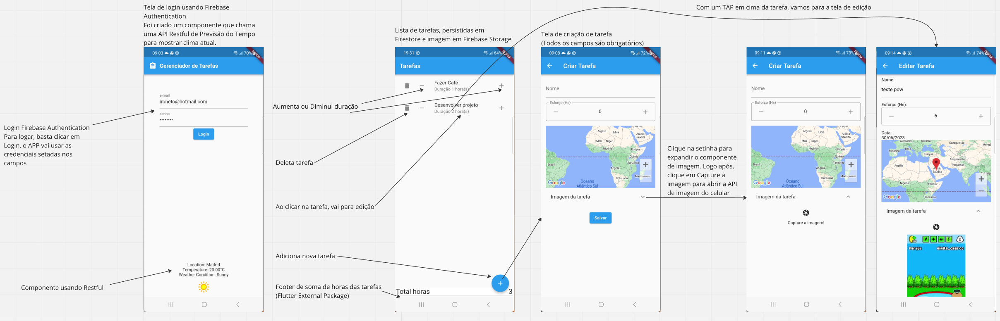

# task_manager

Projeto de Gerenciamento de Tarefas

## Getting Started

Esse projeto é um trabalho de Pós Gradução da disciplina - "Integrações e Publicação de Apps Flutter [23E2_3]".
Professor: Thiago Vieira de Aguiar

## Testes:

Para testar as soluções firebase, faça login, crie, altere e exclua tarefas.

Para testar o consumo de API RESTful, verifique se o componente de Previsão do Tempo foi renderizado com sucesso na tela de login.

Para testar o Package (plugin), verifique se o footer da lista (Total horas), está somando e renderizando corretamente.

## Testes Automatizados:

GenericOverviewCard_test.dart – Teste do External Package (Plugin)
Faz o Mock do método countItems retornando 5 e verifica se os componentes de display mostram a informação corretamente.

login_test.dart – Teste da tela de login e do Firebase Authentication
Faz o Mock do Firebase Authentication para sucesso erro e testa Login com sucesso e Login com erro, usando um callback chamado “onSignedIn” criado na “SignInScreen” que retorna True para logado.

weather_forecast_test.dart – Teste da API RESTful Externa de Previsão do Tempo.

repository_test.darts – Teste do Repositório que manipula o Firestore. Todos os métodos (list, insert, show, update e delete) foram inclusos no teste.

